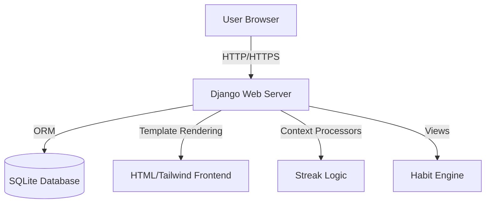

# Architecture Overview 🏗️

MoodNest is built as a monolithic Django web application, designed for simplicity, ease of deployment, and clarity.

## System Components

## Core Modules

### 1. The `habits` App
The core logic resides in the `habits` Django app.
- **Models**:
    - `MoodHabit`: Stores the mapping between moods (e.g., "Anxious") and habits (e.g., "Take deep breaths").
    - `UserMoodLog`: A time-series log of every mood a user records, used for history and streak calculation.
- **Views**:
    - `home`: Landing page, handles mood selection and displays the "Quote of the Day".
    - `get_habit`: The recommendation engine. It filters habits by mood and handles the shuffle logic (excluding specific IDs).
    - `profile`: User management.
- **Utils**:
    - `get_user_streak`: Calculates the consecutive days a user has confirmed a habit.
    - `get_random_quote`: Returns a random inspiring quote.

## Data Flow

1.  **Mood Entry**: User selects a mood on the frontend.
2.  **Request**: `GET /habit/?mood=tired` is sent to the server.
3.  **Processing**:
    - Server filters `MoodHabit` by `mood='tired'`.
    - Randomly selects one habit.
    - Records entry in `UserMoodLog` (if authenticated).
4.  **Response**: Server renders `result.html` with the habit and "Done" button.
5.  **Completion**: User clicks "I Did It", triggering a visual celebration (confetti/animation).

## Design Philosophy
- **Server-Side Rendering (SSR)**: We use Django Templates for fast initial load and SEO, with Alpine.js or vanilla JS for interactivity.
- **Tailwind CSS**: Utility-first styling for rapid UI development and easy customization.
- **No Heavy Dependencies**: We purposefully avoid heavy JS frameworks (React/Vue) or complex databases (PostgreSQL) to keep the project lightweight and "hackable".
